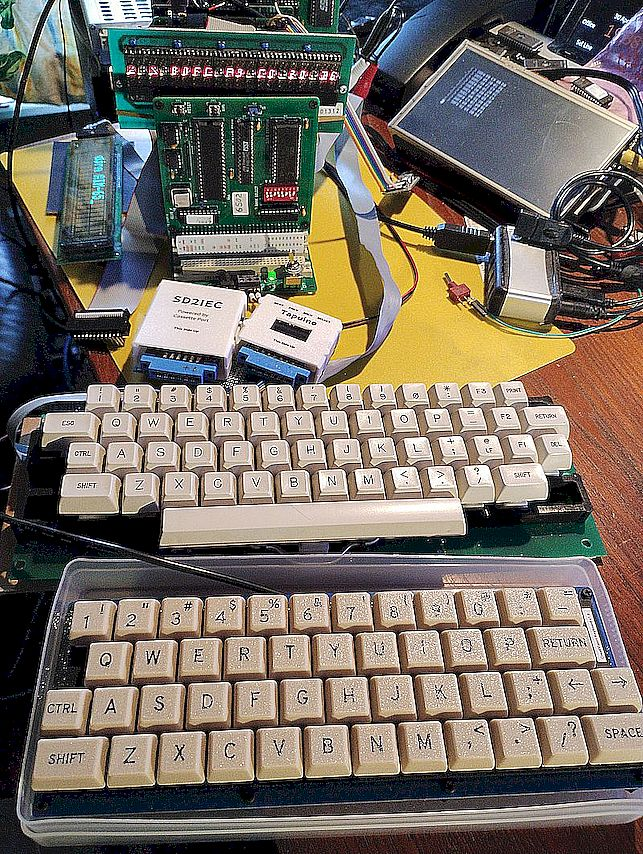

# AIM-65_MECB
Recreation of AIM-65 using MECB boards with 6502 processor

This project is a rework of sources to recreate an AIM-65 with some additional features though optionally retaining use of some original AIM-65 parts.

The memory map of the RAM is unchanged but the periheral devices have been re-worked to fit into the MECB 256 byte I/O space. This may change as I try to recreate a closer approximation to the actual AIM-65 memory map which will remove the need to patch codes to suit.

## The new I/O memory map

These macro definitions are used in the Basic and Monitor sources:

| Name| Location| Device|
|-----|---------|-------|
|MECBIO          |= $A400||
|MECB_USER       |= MECBIO + $B0 | 6522 $A000|
|MECB_RAM        |= MECBIO + $00 | 6532 $A400|
|MECB_KEYBOARD   |= MECBIO + $E0 | 6532 $A480|
|MECB_VIA        |= MECBIO + $C0 | 6522 $A800|
|MECB_DISPLAY    |= MECBIO + $D0 | 6520 $AC00|
|MECB_ACIA       |= MECBIO + $D8 | 6551 used in mecb_bios|
|MECB_SPARE      |= MECBIO + $A0 |  not used|

## RAM

| Name   | Begin| End |
|--------|------|-----|
| System | 0000 | 7FFF|
| Monitor| A400 | A47F|
| Video  | 9000 | 97FF|

## ROM software

| Name   | Begin | End  |
|--------|-------|------|
| Monitor| E000  | FFFF |
| Basic  | B000  | CFFF |
| Bios   | 8000  | 81FF |
| Display| 9900  | 9FFF |
| AH505  | D000  | DFFF |

## Video display

This is the Scott Baker AIM-65 version of the Rockwell design
[Video Dsiplay](https://github.com/sbelectronics/aim65/tree/master/display)

## Display

20x1 LED on AIM 6520
20x2 VFD on USER 6522

## Keyboard

AIM Keyboard on AIM  6532
PS2 Keyboard on USER 6522 using Atmel BIOS

## Serial port

AIM Serial on AIM 6522
ACIA Serial on 6551 UART

## Cassette interface

Tapuino 

## Disk Interface

AH5050 with SD2IEC